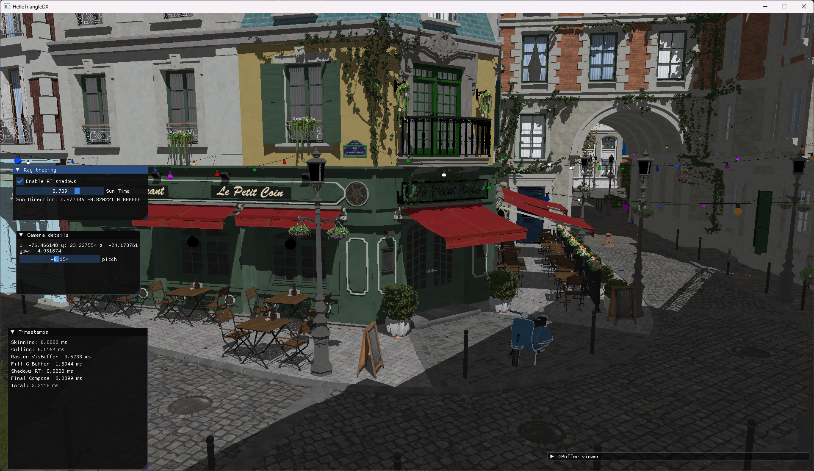

# HelloTriangleDX

For learning purpose.

```
git submodule update --init --recursive
cmake --preset Release
ninja -C Release
```

## Implemented as of August 05 2025

- Fully bindless
- Compute shader skinning
- Culling:
    - Instance level culling from a compute shader
    - Meshlet level culling from amplification shader
    - Primitive level culling from mesh shader
- Rasterize visibility buffer (via mesh shader)
- Fill G-Buffer from visibility buffer
- Raytraced shadows



## Next steps

- More ray tracing
